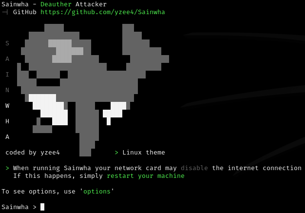
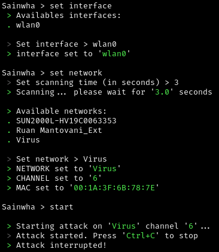
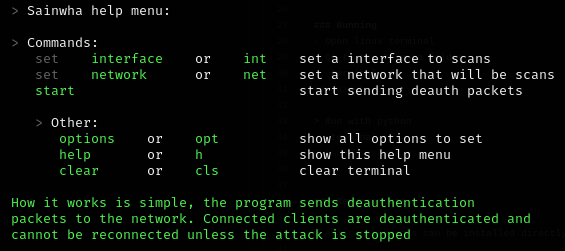

<p align="center">
  
</p>

<p align="center" style="text-align: center;">
  
</p>

How it works is simple, the tool sends deauthentication
packets to the network. Connected clients are deauthenticated and 
cannot be reconnected unless the attack is stopped.

<p align="center">
  
</p>

> Its interface is user-friendly and simple to understand.

<p align="center" style="text-align: center;">
  
</p>

# Installation

Currently Sainwha ```only supports Linux```, and will probably continue to do so. Sainwha ```supports any Linux distribution```. Installation depends only on the terminal.
> Open Linux terminal
```terminal
git clone https://github.com/yzee4/Sainwha.git
```

<h4></h4>

<p align="center" style="text-align: center;">
  
</p>

<p align="center">
  
</p>

> This is an example of a deauthentication attack on a network

<p align="center" style="text-align: center;">
  
</p>

First we define the scanning interface, then we check and configure the network to attack. The attack is launched and clients are disconnected until the attack is stopped.

<p align="center" style="text-align: center;">
  
</p>

# Running
After installation, just run the program
> Open Linux terminal

1. Go to Sainwha folder
```terminal
cd Sainwha
```
2. Run with Python3
```terminal
python3 sainwha.py
```

<p align="center" style="text-align: center;">
  
</p>

<h4></h4>

<p align="center" style="text-align: center;">
  
</p>

As it is an easy-to-use tool, the options are simple and easy to understand. The variables that need to be set are just ```Interface``` with ```set interface``` or just ```int```, and ```Network``` with ```set network``` or just ```net```.

<p align="center">
  
</p>

This menu can be opened within the tool with ```help```.

<p align="center" style="text-align: center;">
  
</p>

# Requirements

> All requirements can be installed directly on the terminal

   - `Python3` For running tool. To install use `sudo apt install python3`
   - `Git` For install tool. To install use `sudo apt install git`
   - `Aircrack-ng` For scans all networks and sends deauthentication packets. To  install use `sudo apt install aircrack-ng`
   - `Net-tools` For set interface to scans. To install use `sudo apt install net-tools`

<h1></h1>

<p align="center" style="text-align: center;">
  
</p>

<p align="center">
  
</p>

<p align="center">
  
  
</p>
